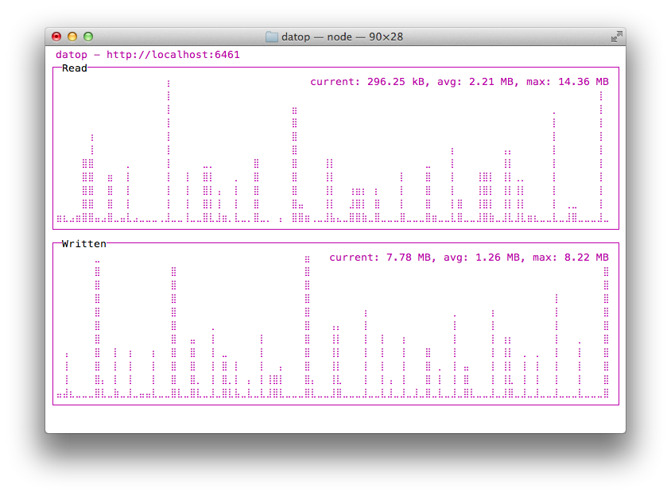

# datop

`top` for [dat](https://github.com/maxogden/dat)



[](https://nodei.co/npm/datop/)

```
npm install datop -g
datop http://mydat
```

if you just run `datop` it will try and connect to `localhost:6461` (the default dat port)

idea/design inspired by [vtop](https://www.npmjs.org/package/vtop)
